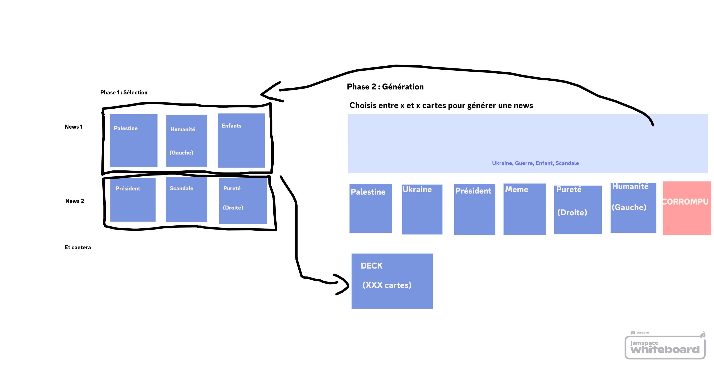

**Introduction**

This repository contains the code for GameJamConsume (TODO change name), game created for the [Godot Wild Jam 83](https://itch.io/jam/godot-wild-jam-83).

**The game itself**

The game is a simple deckbuild where you're playing a generative AI that is trying to consume the news from the internet and training from it.
Each news has keywords and are politically biased. For example, if you're choosing to consume the word "Trump", your AI will be trained to be more right-wing.

Your goal is to please the audience by consuming left-wing content and pleas your creator by consuming right-wing content. But if you're consuming too much of the other wings, some will be pissed.
For example: if you're consuming too much left-wing content, your creator will be pissed.

**Prototype schema**

The first version of the game is only the right hand side of the schema.